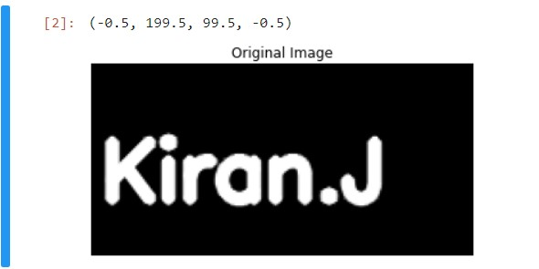
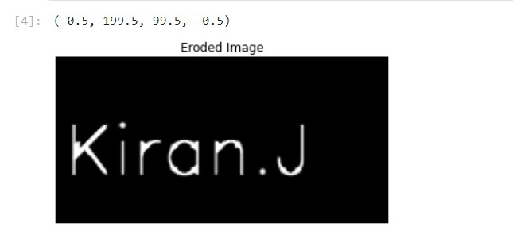
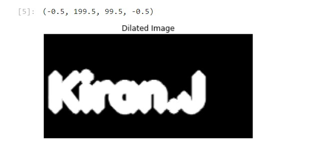

# Implementation-of-Erosion-and-Dilation
## Aim
To implement Erosion and Dilation using Python and OpenCV.
## Software Required
1. Anaconda - Python 3.7
2. OpenCV
## Algorithm:
### Step1:
Import the necessary packages.

### Step2:
Create the text image using cv2.putText.

### Step3:
Then create the structuring image for dilation/erosion.

### Step4:
Apply erosion and dilation using cv2.erode and cv2.dilate.

### Step5:
Plot the images using plt.imshow.
 
## Program:

``` Python
Developed by : Kiran J
Registeration Number: 212221240022

# Import the necessary packages
import cv2
import numpy as np
import matplotlib.pyplot as plt

# Create the Text using cv2.putText
img1=np.zeros((100,200),dtype= 'uint8') 
font=cv2.FONT_HERSHEY_SIMPLEX
cv2.putText(img1,'Kiran.J',(5,70),font,1.4,(255),5,cv2.LINE_AA)
plt.imshow(img1,cmap='gray')
plt.title("Original Image")
plt.axis('off')

# Create the structuring element
kernel = cv2.getStructuringElement(cv2.MORPH_CROSS,(7,7))

# Erode the image
image_erode = cv2.erode(img1,kernel)
plt.title("Eroded Image")
plt.imshow(image_erode,cmap='gray')
plt.axis('off')

# Dilate the image
image_dilate = cv2.dilate(img1,kernel)
plt.title("Dilated Image")
plt.imshow(image_dilate,'magma')
plt.axis('off')


```
## Output:

### Display the input Image


### Display the Eroded Image


### Display the Dilated Image


## Result
Thus the generated text image is eroded and dilated using python and OpenCV.